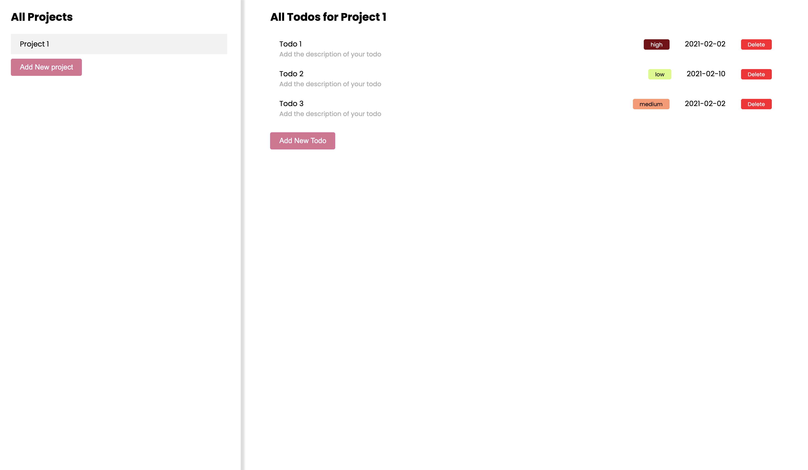
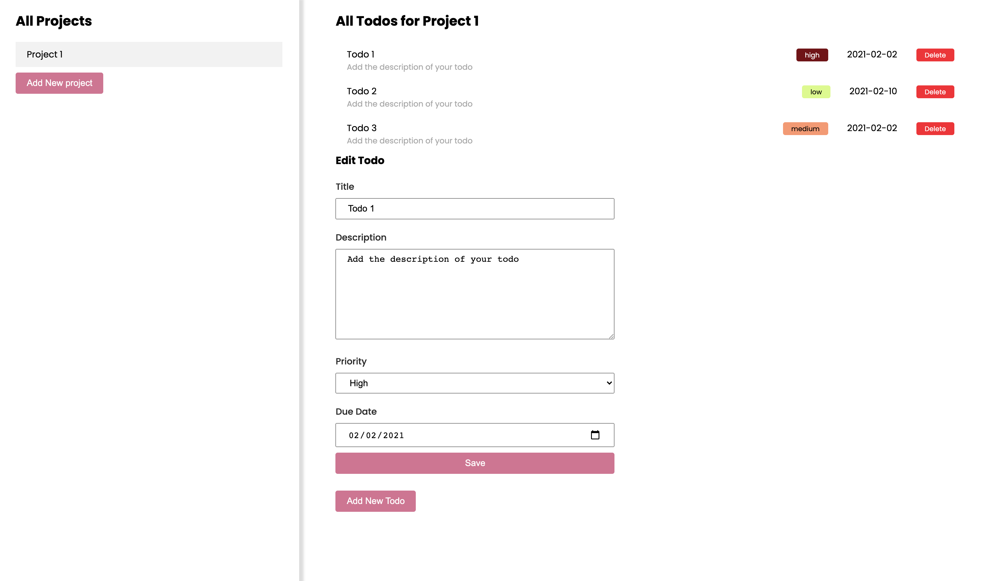
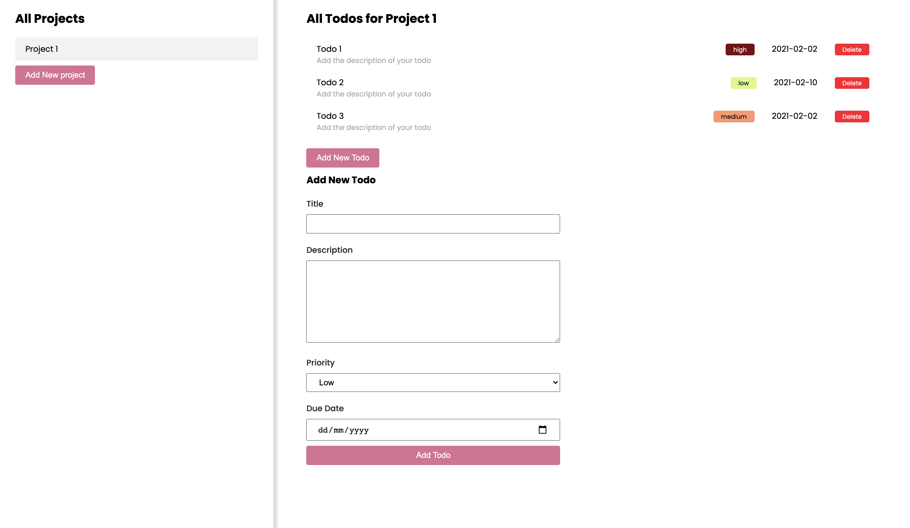
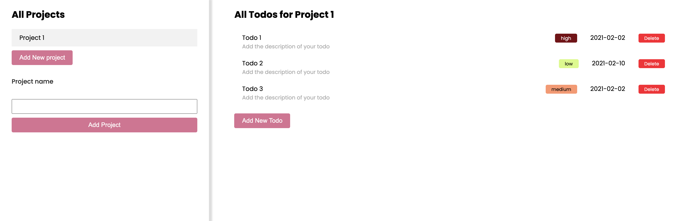

# Task Todo (Page is not responsive)

> I have created this todoList app with 1 default project and 2 default todos in it. The whole app is built with vanilla Javascript and jquery. For styling I have used Css. In this app user can perform following actions:

- Add a new Project
- Add a new Todo in the selected project
- Edit todo details
- Delete a todo test

> Todo priority colors are different as per the priority level. All the data is getting saved in local storage and we are pulling data from the local storage.

> Todo list
> 

> Edit todo
> 

> Add todo
> 

> Add project
> 

## Built With

- Javascript
- Jquery
- Webpack
- ESLint
- Stylelint

## Live Demo

[Task_todo](https://task-todo-git-working-branch.royamita.vercel.app)

### Prerequisites

Node

**Setup**

- Clone this repository with: "git clone git@github.com:Amita-Roy/Task-Todo.git" using your terminal or command line.

- Change to the project directory by entering cd "task-todo" in the terminal

- Next run npm install to install the necessary dependencies

- Finally run the 'npm run build' and 'npm start' to start the application

- 'npm run dev' is for building the project in development mode

- 'npm run build' is for building the project in production mode

- 'npm start' is for starting the server in development mode

### Usage

Start server with:

```
    npm start
```

## Author

👤 **Amita Roy**

- Github: [@Amita](https://github.com/Amita-Roy)
- Twitter: [@Amita](https://twitter.com/AmitaRoy14)
- Linkedin: [@Amita](https://www.linkedin.com/in/amita-roy-3b823b68/)

## 🤝 Contributing

Contributions, issues and feature requests are welcome!

Feel free to check the [issues page](issues/).

## Show your support

Give a ⭐️ if you like this project!

## 📝 License
